# Contexto

Un proyecto que implementa un sencillo juego con agentes de [JADE](https://jade.tilab.com/) y una ontología para la comunicación de estos agentes. Realizado en colaboración con otros 3 compañeros.

En el directorio **jar-final** se dispone un jar con el proyecto final y sus dependencias, además de un script para lanzarlo. Sin embargo, es bastante probable que l host deba ser modificado pues se hacía uso de un servidor de la universidad.

# Juego Espías

Dos potencias enfrentadas, cada una buscando expandir su influencia mientras limita la del otro, con jugadores que representan las agencias de inteligencia de estas potencias, dedicadas al espionaje para ganar ventaja estratégica y al contraespionaje para proteger sus propios secretos. El objetivo es ganar puntos de influencia realizando exitosas operaciones de espionaje y prevenir la pérdida de puntos protegiendo la información propia de ser espiada por el adversario. Las mecánicas básicas incluyen operaciones de espionaje, donde los agentes pueden intentar infiltrarse en el territorio del otro para robar información, ganando puntos por cada operación exitosa, y operaciones de contraespionaje, donde los agentes pueden proteger su territorio detectando y deteniendo espías, previniendo la pérdida de puntos y posiblemente ganando puntos al capturar un espía. Además, ambos jugadores deben gestionar cuidadosamente sus recursos limitados, como agentes, tecnología e información, ya que cada acción consume recursos.

## Análisis

### Agentes Involucrados

- **``Monitor:``** el **AgenteMonitor** se encargará de toda la gestión del sistema. Pondrá en marcha a los agentes **Organizador**, **Espía** y **Seguridad**, una vez sea activado. Una vez creados los agentes, será quien inicie la gestión de crear un juego nuevo, contactar con los jugadores disponibles y trasladar el comienzo de los juegos al agente **Organizador**. También, será el responsable de procesar la información de los agente **Organizador** y reflejarla en la interfaz gráfica de usuario.
- **``Organizador:``** las tareas del **AgenteOrganizador** consisten en proponer una partida a aquellos jugadores disponibles que aceptaron iniciar un juego, y crearles un nuevo **Tablero** para que la partida pueda desarrollarse.
- **``Tablero:``** el AgenteTablero se encargará de recibir las operaciones de exploración y acciones estratégicas por parte de los AgenteEspía y AgenteSeguridad a lo largo de todo el trascurso de la partida. Será también el gestor de la asignación de los puntos de cada agente, y de guardar un registro de todas las acciones tomadas por estos para su posterior reproducción.
- **``Espía:``** El **AgenteEspia** es uno de los dos jugadores enfrentados en este juego. Durante la fase de exploración, tratará de obtener información del tablero de juego, que será empleada con posterioridad e la fase de acción para asignar una estrategia a cada zona, dependiendo en cada caso de la información que se tiene de cada zona.
-  **``Seguridad:``** el **AgenteSeguridad** será uno de los jugadores y se encargará de neutralizar la actividad del agente **Espía**. Para ello se unirá a los juegos y partidas propuestas por el Agente Monitor y por el Agente Organizador respectivamente, además de emplear distintas estrategias para ganar la partida.

### Elementos Necesarios para el Intercambio de Información entre Agentes

Las necesidades de comunicación entre los agentes implicados son las siguientes:
- El **AgenteMonitor** enviará una proposición de iniciar un juego a varios **AgenteJugador**, tanto del tipo Espía como Seguridad.
- El **AgenteMonitor** organizará un nuevo juego y enviará al **AgenteOrganizador** la información de este juego junto con una lista de los posibles jugadores.
- El **AgenteMonitor** se suscribirá al **AgenteOrganizador** para las futuras comunicaciones de los resultados de los juegos realizados y las posibles incidencias que ocurran.
- El **AgenteOrganizador** propondrá una nueva partida a cada uno de los posibles jugadores. Los primeros en aceptar serán los futuros jugadores de la partida.
- El **AgenteOrganizador** mandará al **AgenteTablero** la información de la nueva partida y de los jugadores participantes.
- El **AgenteTablero** solicitará el inicio de la fase de exploración a los jugadores.
- El **AgenteTablero** recogerá los puntos de acción asignados a la exploración por parte de cada agente y los registrará en un archivo.
- El **AgenteTablero** enviará los resultados de la exploración realizada por el **AgenteJugador** y también la zona explorada por su rival.
- El **AgenteTablero** comenzará la fase de asignación de estrategias y solicitará a los AgenteJugador mandar sus estrategias.
- El **AgenteTablero** computará los puntos de cada estrategia por cada zona, y los registrará.
- El **AgenteTablero** dará por finalizada la partida al acabar la fase de estrategias, guardará los resultados finales y los comunicará al **AgenteOrganizador**.
- El **AgenteOrganizador** mandará los resultados o incidencias de las partidas realizadas por los **AgenteTablero** al **AgenteMonitor**.
- El **AgenteEspia** empleará una única tarea de recepción, que redirigirá la respuesta al mensaje a funciones especializadas dependiendo del mensaje recibido.
- El **AgenteSeguridad** responderá a las proposiciones de iniciar un juego del **AgenteMonitor**.
- El **AgenteSeguridad** responderá a las proposiciones de iniciar una partida del **AgenteOrganizador**
- El **AgenteSeguridad** responderá a mediante el contract-net a las solicitudes de exploración y de estrategia del agente **AgenteTablero**, transmitiendo y procesando la información necesaria para ello.

### Definición de los Protocolos de Comunicación

Los diferentes **protocolos FIPA** de comunicación de los agentes que participan en la práctica son *Propose*, *CFP* y *Subscribe*.

#### Diagramas de Interacción

##### Proponer Juego
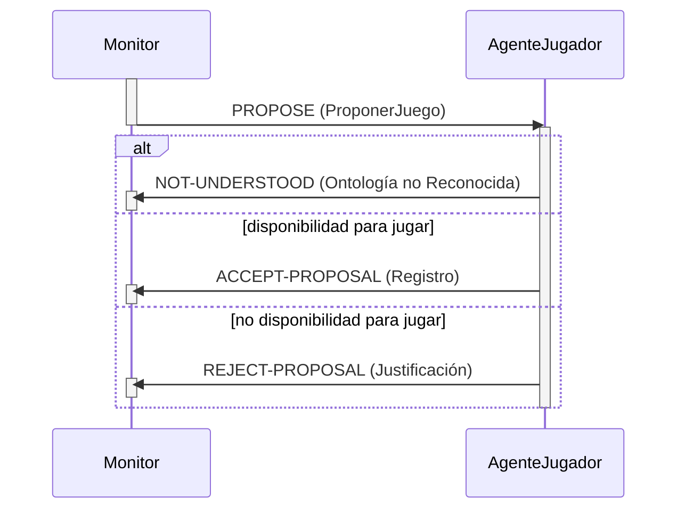
``` mermaid
sequenceDiagram

participant M as Monitor
participant J as AgenteJugador

activate M
M->>J: PROPOSE (ProponerJuego)
deactivate M
activate J
alt 
	J->>M: NOT-UNDERSTOOD (Ontología no Reconocida)
	activate M
	deactivate M
	
else disponibilidad para jugar
	J->>M: ACCEPT-PROPOSAL (Registro)
	activate M
	deactivate M

else no disponibilidad para jugar
	J->>M: REJECT-PROPOSAL (Justificación)
	activate M
	deactivate M
	
end
deactivate J

```

##### Organizar Juego
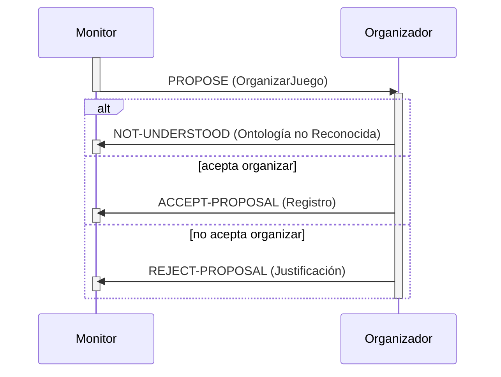
``` mermaid
sequenceDiagram

participant M as Monitor
participant O as Organizador

activate M
M->>O: PROPOSE (OrganizarJuego)
deactivate M
activate O
alt 
	O->>M: NOT-UNDERSTOOD (Ontología no Reconocida)
	activate M
	deactivate M
	
else acepta organizar
	O->>M: ACCEPT-PROPOSAL (Registro)
	activate M
	deactivate M

else no acepta organizar
	O->>M: REJECT-PROPOSAL (Justificación)
	activate M
	deactivate M
	
end
deactivate O

```

##### Registrar Incidencias
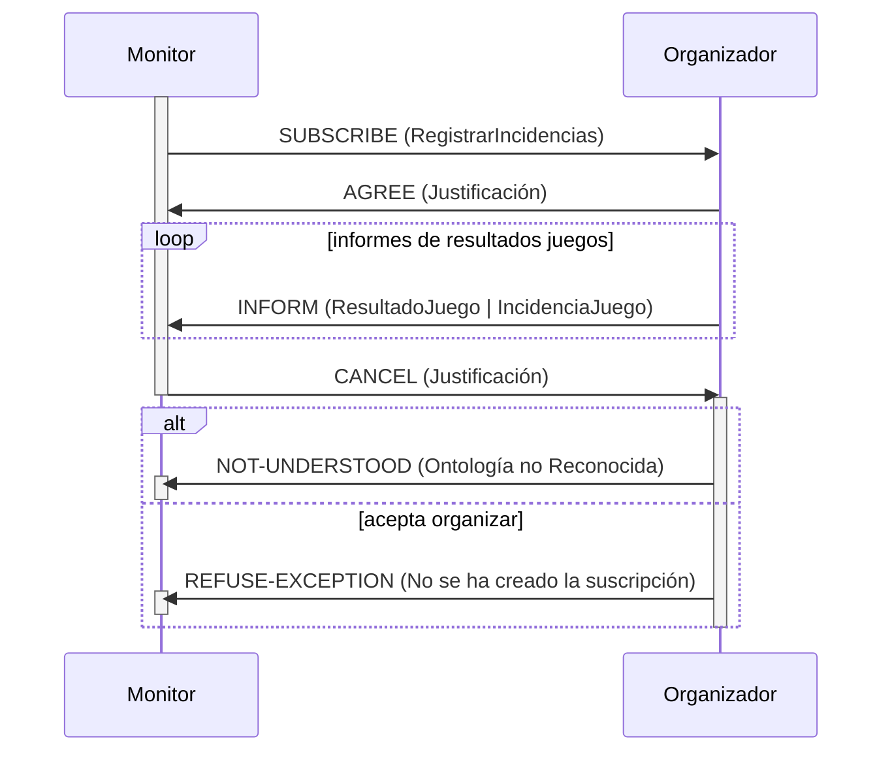
``` mermaid
sequenceDiagram

participant M as Monitor
participant O as Organizador

activate M
M->>O: SUBSCRIBE (RegistrarIncidencias)
O->>M: AGREE (Justificación)
loop informes de resultados juegos
	O->>M: INFORM (ResultadoJuego | IncidenciaJuego)
end
M->>O: CANCEL (Justificación)
deactivate M
activate O
alt 
	O->>M: NOT-UNDERSTOOD (Ontología no Reconocida)
	activate M
	deactivate M
	
else acepta organizar
	O->>M: REFUSE-EXCEPTION (No se ha creado la suscripción)
	activate M
	deactivate M
	
end
deactivate O

```
##### Iniciar Partida
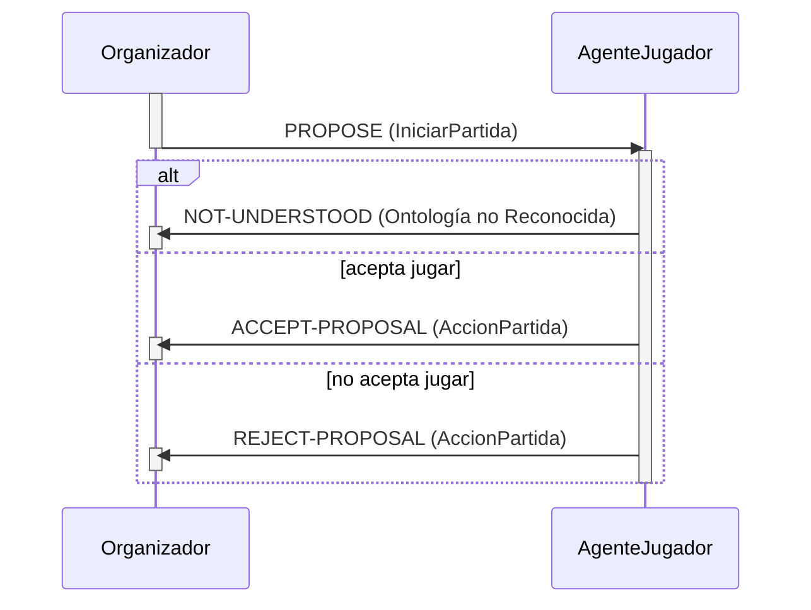
``` mermaid
sequenceDiagram

participant O as Organizador
participant J as AgenteJugador

activate O
O->>J: PROPOSE (IniciarPartida)
deactivate O
activate J
alt 
	J->>O: NOT-UNDERSTOOD (Ontología no Reconocida)
	activate O
	deactivate O
	
else acepta jugar
	J->>O: ACCEPT-PROPOSAL (AccionPartida)
	activate O
	deactivate O

else no acepta jugar
	J->>O: REJECT-PROPOSAL (AccionPartida)
	activate O
	deactivate O
	
end
deactivate J

```

##### Solicitar Exploración
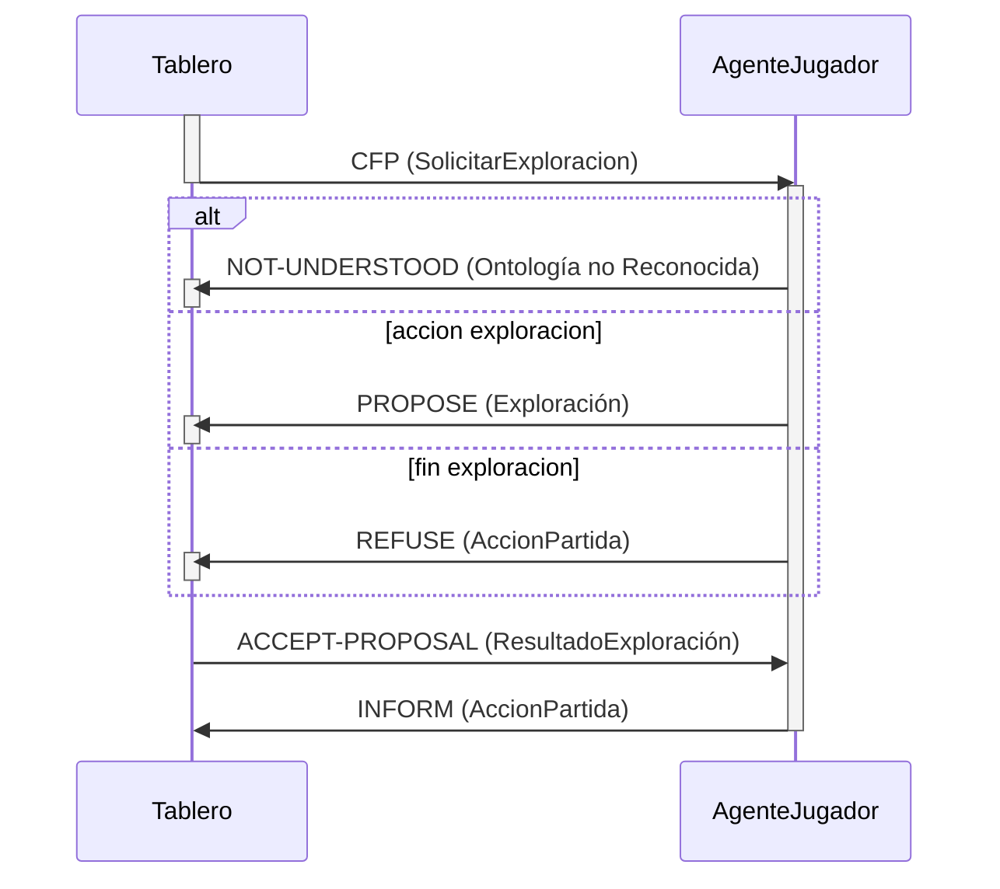
``` mermaid
sequenceDiagram

participant T as Tablero
participant J as AgenteJugador

activate T
T->>J: CFP (SolicitarExploracion)
deactivate T
activate J
alt 
	J->>T: NOT-UNDERSTOOD (Ontología no Reconocida)
	activate T
	deactivate T
	
else accion exploracion
	J->>T: PROPOSE (Exploración)
	activate T
	deactivate T

else fin exploracion
	J->>T: REFUSE (AccionPartida)
	activate T
	deactivate T
	
end

T->>J: ACCEPT-PROPOSAL (ResultadoExploración)
J->>T: INFORM (AccionPartida)

deactivate J

```

##### Asignar Estrategias
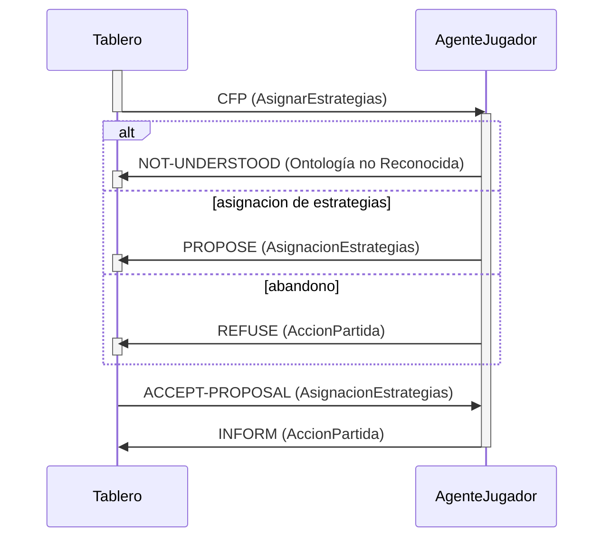
``` mermaid
sequenceDiagram

participant T as Tablero
participant J as AgenteJugador

activate T
T->>J: CFP (AsignarEstrategias)
deactivate T
activate J
alt 
	J->>T: NOT-UNDERSTOOD (Ontología no Reconocida)
	activate T
	deactivate T
	
else asignacion de estrategias
	J->>T: PROPOSE (AsignacionEstrategias)
	activate T
	deactivate T

else abandono
	J->>T: REFUSE (AccionPartida)
	activate T
	deactivate T
	
end

T->>J: ACCEPT-PROPOSAL (AsignacionEstrategias)
J->>T: INFORM (AccionPartida)

deactivate J

```


### Definición de Tareas

Para el desarrollo de la comunicación anterior se necesitan ciertas tareas que lleven a cabo la toma de contacto y el intercambio de información.

#### Monitor
- **TareaCrearAgentes**
> **Tipo**: One Shot.

> **Activación**: Tras la activación del agente.

> **Finalización**: Cuando termina de crear todos los agentes necesarios para la práctica
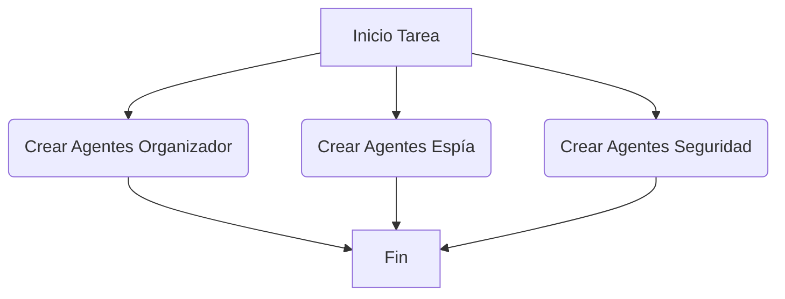
```mermaid

flowchart TD

A[Inicio Tarea] --> B(Crear Agentes Organizador)
A[Inicio Tarea] --> C(Crear Agentes Espía)
A[Inicio Tarea] --> D(Crear Agentes Seguridad)

B --> E[Fin]
C --> E[Fin]
D --> E[Fin]

```  
- **TareaProponerJuego**
> **Tipo**: Ticker.

> **Activación**: Tras la activación del agente.

> **Finalización**: Cuando se le pide al agente que finalice su ejecución

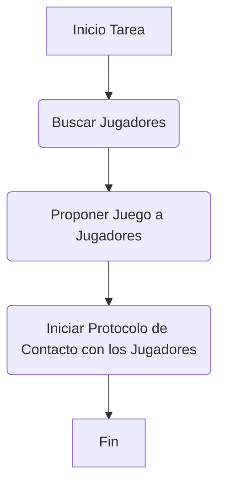
```mermaid
flowchart TD

A[Inicio Tarea] --> C(Buscar Jugadores)

C --> D(Proponer Juego a Jugadores)

D --> E(Iniciar Protocolo de Contacto con los Jugadores)

E --> F[Fin]

```
- **TareaProponerJuegoIniciador**
> **Tipo**: ProposeInitiator.

> **Activación**: Tras la selección de jugadores espía y seguridad.

> **Finalización**: Cuando recibe respuesta por parte del espía y la seguridad actúa en consecuencia.

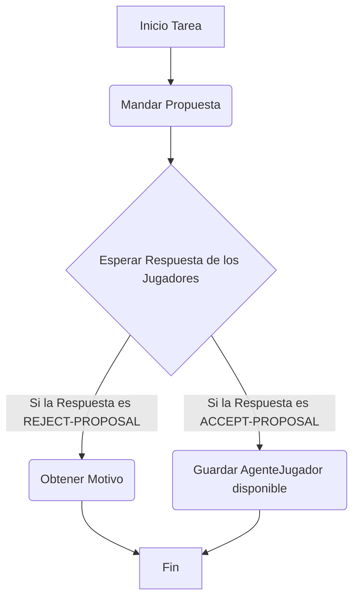
```mermaid
flowchart TD

A[Inicio Tarea] --> B(Mandar Propuesta)

B --> C{Esperar Respuesta de los Jugadores}

C -- Si la Respuesta es REJECT-PROPOSAL --> D(Obtener Motivo)

C -- Si la Respuesta es ACCEPT-PROPOSAL --> E(Guardar AgenteJugador disponible)

D --> H[Fin]
E --> H[Fin]

```

- **TareaOrganizarJuego**
> **Tipo**: Ticker.

> **Activación**: Tras la activación del agente.

> **Finalización**: Cuando se le pide al agente que finalice su ejecución

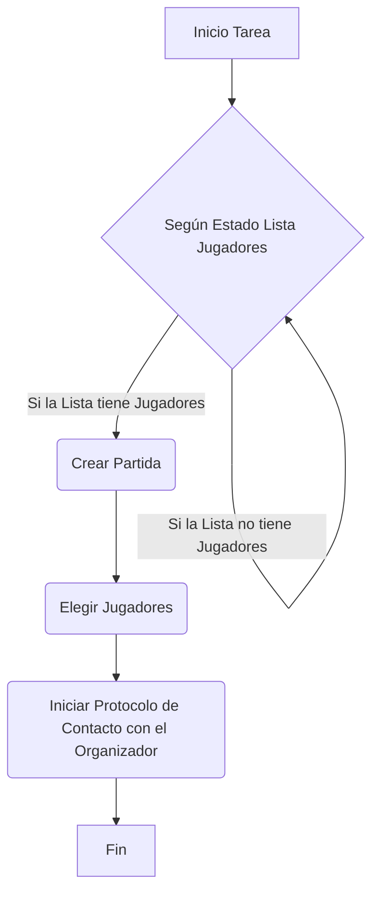
```mermaid
flowchart TD

A[Inicio Tarea] --> B{Según Estado Lista Jugadores}

B -- Si la Lista no tiene Jugadores --> B

B -- Si la Lista tiene Jugadores --> C(Crear Partida)

C --> D(Elegir Jugadores)

D --> E(Iniciar Protocolo de Contacto con el Organizador)

E --> F[Fin]

```

- **TareaOrganizarJuegoIniciador**
> **Tipo**: ProposeInitiator.

> **Activación**: Tras la aceptación de juego por parte de jugadores espía y seguridad.

> **Finalización**: Cuando recibe respuesta por parte del organizador actúa en consecuencia.

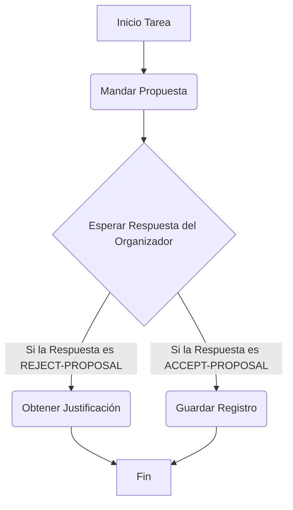
```mermaid
flowchart TD

A[Inicio Tarea] --> B(Mandar Propuesta)

B --> C{Esperar Respuesta del Organizador}

C -- Si la Respuesta es REJECT-PROPOSAL --> D(Obtener Justificación)

C -- Si la Respuesta es ACCEPT-PROPOSAL --> E(Guardar Registro)

D --> H[Fin]
E --> H[Fin]

```

- **TareaSuscripcionOrganizador**
> **Tipo**: OneShotBehaviour.

> **Activación**: Tras la activación del agente.

> **Finalización**: Cuando termine sus objetivos.

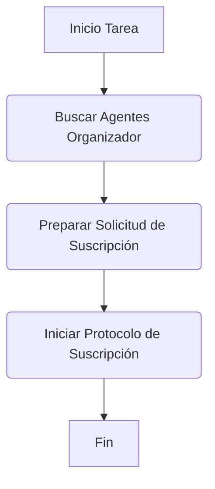
```mermaid
flowchart TD

A[Inicio Tarea] --> B(Buscar Agentes Organizador)

B --> C(Preparar Solicitud de Suscripción)

C --> D(Iniciar Protocolo de Suscripción)

D --> H[Fin]

```

**TareaSuscripcionOrganizadorIniciador**
> **Tipo**: SubscriptionInitiator.

> **Activación**: Tras el envío de solicitud de suscripción.

> **Finalización**: Cuando recibe respuesta por parte del agente Organizador.

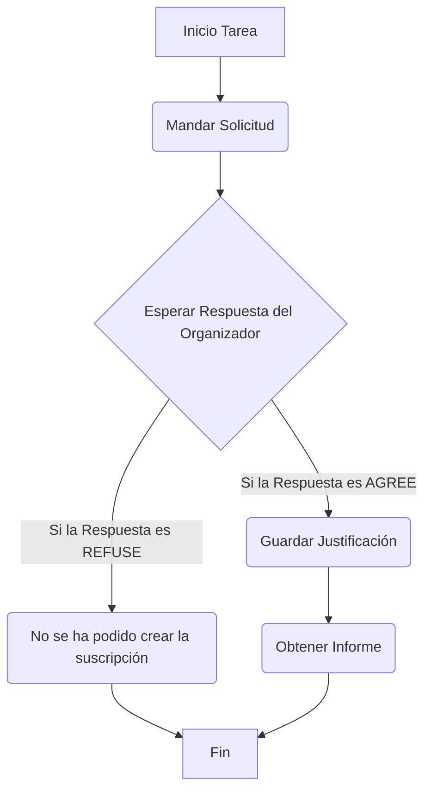
```mermaid
flowchart TD

A[Inicio Tarea] --> B(Mandar Solicitud)

B --> C{Esperar Respuesta del Organizador}

C -- Si la Respuesta es REFUSE --> D(No se ha podido crear la suscripción)

C -- Si la Respuesta es AGREE --> E(Guardar Justificación)

E --> F(Obtener Informe) 

D --> H[Fin]
F --> H[Fin]

```

#### Organizador
- **TareaOrganizarJuegoParticipante**
> **Tipo**: ProposeResponder.

> **Activación**: Tras la activación del agente.

> **Finalización**: Cuando mande una respuesta al agente Monitor.

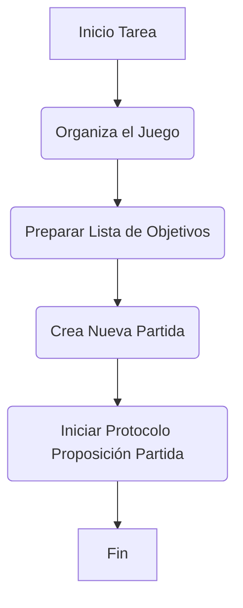
```mermaid
flowchart TD

A[Inicio Tarea] --> B(Organiza el Juego)

B --> C(Preparar Lista de Objetivos)

C --> D(Crea Nueva Partida)

D --> E(Iniciar Protocolo Proposición Partida)

E --> H[Fin]

```

- **TareaComprobarDisponibilidadJugadores**
> **Tipo**: OneShotBehaviour.

> **Activación**: Tras recibir la propuesta de iniciar una nueva partida.

> **Finalización**: Cuando haya mandado todas las propuestas de partida a los jugadores.

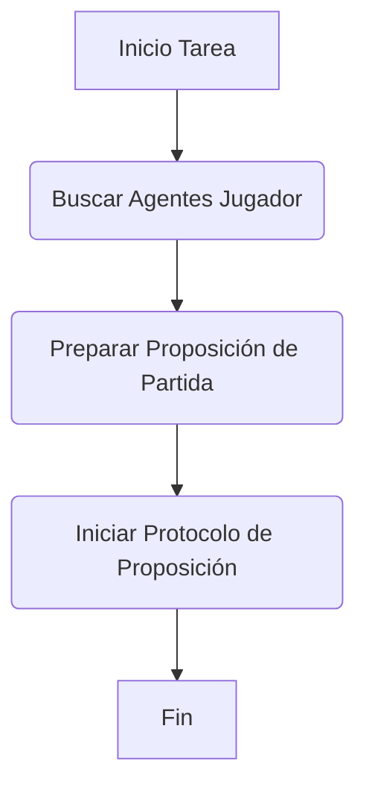
```mermaid
flowchart TD

A[Inicio Tarea] --> B(Buscar Agentes Jugador)

B --> C(Preparar Proposición de Partida)

C --> D(Iniciar Protocolo de Proposición)

D --> H[Fin]

```

- **TareaIniciarPartidaIniciador**
> **Tipo**: ProposeInitiator.

> **Activación**: Tras recibir la propuesta de iniciar una nueva partida.

> **Finalización**: Cuando reciba las distintas respuestas de los jugadores.

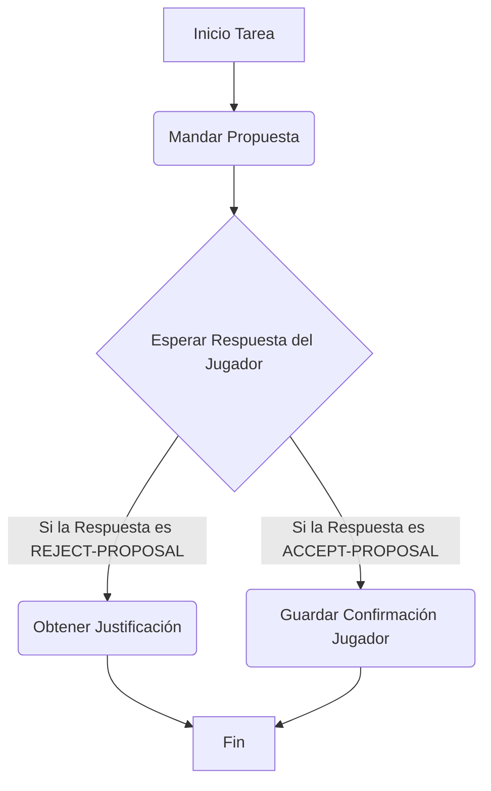
```mermaid
flowchart TD

A[Inicio Tarea] --> B(Mandar Propuesta)

B --> C{Esperar Respuesta del Jugador}

C -- Si la Respuesta es REJECT-PROPOSAL --> D(Obtener Justificación)

C -- Si la Respuesta es ACCEPT-PROPOSAL --> E(Guardar Confirmación Jugador)

D --> H[Fin]
E --> H[Fin]

```

- **TareaComprobarAgentesJugador**
> **Tipo**: TickerBehaviour.

> **Activación**: Tras la recepción de una nueva partida.

> **Finalización**: Cuando los agentes jugadores hayan contestado a la propuesta.

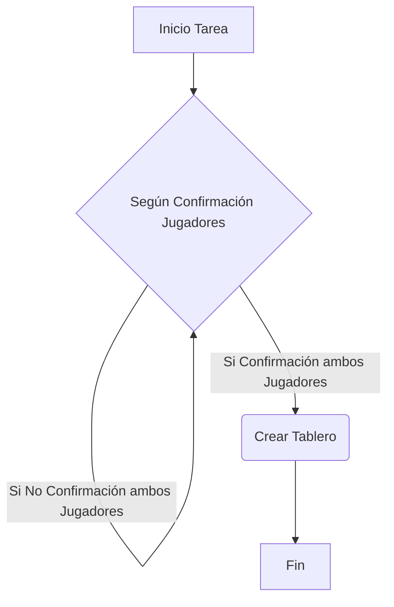
```mermaid
flowchart TD

A[Inicio Tarea] --> B{Según Confirmación Jugadores}

B -- Si No Confirmación ambos Jugadores --> B

B -- Si Confirmación ambos Jugadores --> C(Crear Tablero)

C --> F[Fin]

```

- **TareaSuscripcionOrganizadorParticipante**
> **Tipo**: SubscriptionResponder.

> **Activación**: Tras la activación del agente.

> **Finalización**: Cuando reciba la solicitud de suscripción por parte del agente Monitor.

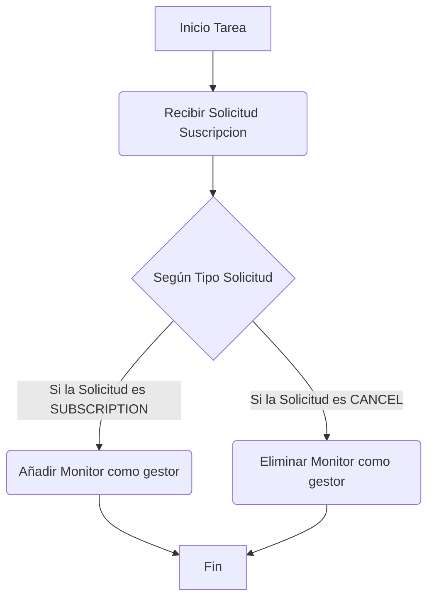
```mermaid
flowchart TD

A[Inicio Tarea] --> B(Recibir Solicitud Suscripcion)

B --> C{Según Tipo Solicitud}

C -- Si la Solicitud es SUBSCRIPTION --> D(Añadir Monitor como gestor)

C -- Si la Solicitud es CANCEL --> E(Eliminar Monitor como gestor)

D --> H[Fin]
E --> H[Fin]

```

- **TareaAvisoMonitor**
> **Tipo**: OneShotBehaviour.

> **Activación**: Tras la recepción de un resultado o incidencia de una partida.

> **Finalización**: Cuando mande el aviso al agente Monitor.

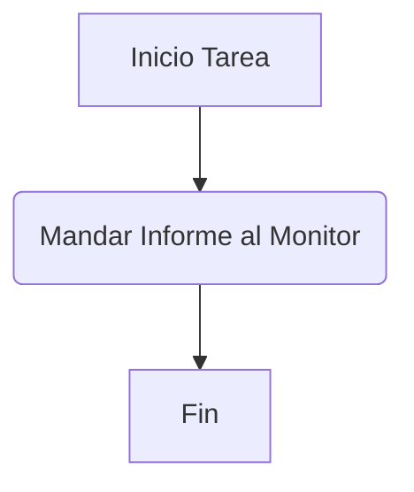
```mermaid
flowchart TD

A[Inicio Tarea] --> B(Mandar Informe al Monitor)

B --> H[Fin]

```


#### Tablero

- **TareaIniciarPartida**
> **Tipo**: OneShotBehaviour.

> **Activación**: Tras la activación del agente.

> **Finalización**: Cuando mande la solicitud a los jugadores.

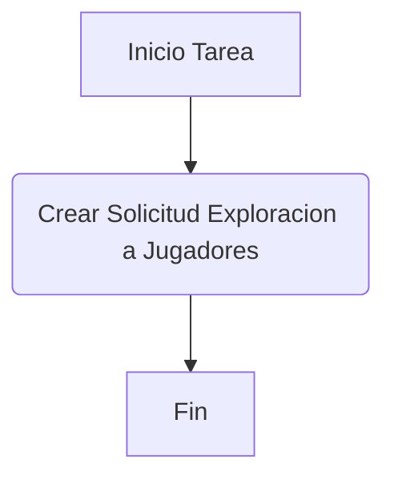
```mermaid
flowchart TD

A[Inicio Tarea] --> B(Crear Solicitud Exploracion a Jugadores)

B --> H[Fin]

```

- **TareaIniciarAsignacionEstrategias**
> **Tipo**: TickerBehaviour.

> **Activación**: Tras la activación del agente Tablero.

> **Finalización**: Cuando los agentes jugadores hayan finalizado la exploración.

```mermaid
flowchart TD

A[Inicio Tarea] --> B{Según Finalización Exploración Jugadores}

B -- Si No Confirmación ambos Jugadores --> B

B -- Si Confirmación ambos Jugadores --> C(Comenzar Asignación de Estrategias)

C --> F[Fin]

```

- **TareaSolicitarExploracionIniciador**
> **Tipo**: ContractNetInitiator.

> **Activación**: Tras el inicio de la solicitud de exploración.

> **Finalización**: Cuando recibe la respuesta de finalizar exploración por parte de los jugadores.

```mermaid
flowchart TD

A[Inicio Tarea] --> B(Mandar Solicitud de Exploración)

B --> C{Esperar Respuesta del Jugador}

C -- Si la Respuesta es PROPOSE --> D(Obtener Zona Exploración)
D --> E(Mandar al Jugador su Resultado Exploración y Zona Explorada Rival)

C -- Si la Respuesta es REFUSE --> F(Finalizar Exploración)

C -- Si la Respuesta es INFORM --> G{Dependiendo Acción}

G -- Si la Acción es FIN_EXPLORACIÓN --> F
G -- Si la Acción es SEGUIR_JUGANDO --> C

F --> H[Fin]

```

- **TareaAsignarEstrategiasIniciador**
> **Tipo**: ContractNetInitiator.

> **Activación**: Tras la finalización de la fase de exploración.

> **Finalización**: Cuando recibe la respuesta de los jugadores con sus estrategias.

```mermaid
flowchart TD

A[Inicio Tarea] --> B(Mandar Solicitud de Asignación)

B --> C{Esperar Respuesta del Jugador}

C -- Si la Respuesta es PROPOSE --> D(Obtener Estrategias)
D --> E(Mandar al Jugador su Resultado Estrategia y Resultado Rival)

C -- Si la Respuesta es REFUSE --> F(Mandar Incidencia)

C -- Si la Respuesta es INFORM --> G(Calcular Puntuación)

F --> H[Fin]
G --> H[Fin]

```
#### Espía

```mermaid
flowchart TD

A[Inicio] --> B{¿Hay mensajes en el buzón?}
B -- NO --> Z[Finalizar]
B -- SI --> C{¿De que tipo es?}
C -- Peticion disponibilidad/participación --> D{¿Estoy disponible?}
D -- NO --> E[Rechazar]
D -- SI --> F[Aceptar]
C -- Continuacion de partida --> G{¿En que fase?}
G -- Exploración --> H[Redirigir a la tarea de exploración]
G -- Estrategia --> I[Redirigir a la tarea de selección de estrategia]
E --> J[Vuelvo a revisar el buzon]
F --> J
H --> J
I --> J
J --> B
```

- **Disponibilidad del agente**: El agente responde afirmativamente siempre y cuando este participe en menos de 5 partidas, el agente no reserva esta disponibilidad, y puede ser rechazada más adelante.


##### Exploración

Se considera que los puntos invertidos en exploración son menos útiles que los invertidos en las estrategias, ya que el juego premia el asignar una estrategia a cada zona. Por ello, la fase de estrategia finalizará tras la mínima inversión de puntos posibles en ella.

```mermaid
flowchart TD

A[Inicio] --> B{¿Es una partida nueva?}
B -- NO --> D[Agregar informacion recibida al mapa]
B -- SI --> C[Agregar mapa de partida]
C --> E{¿Quedan zonas por explorar?}
D --> E
E -- NO --> F[Solicitar fin de la exploracion]
E -- SI --> G[Solicitar Explorar una nueva casilla]
```

##### Asignación de estrategias

En cuanto a la fase de asignación de estrategias, se usará la mejor estrategia disponible, EO, en las zonas de importancia normal o inferior. En caso de zonas de mayor importancia, se supone que el agente seguridad realizará una mayor inversión de puntos, por lo que se tratará de contrarrestar su estrategia con la estrategia DE (Si se cuenta con puntos suficientes).

```mermaid
flowchart TD

A[Inicio] --> B[Iterar sobre una zona]
B --> C{¿Que se sobre la zona?}
C -- No se nada / Es de tipo normal o inferior --> D[Aplicar mi mejor estrategia, EO]
C -- Es de alto valor --> E{¿Tengo puntos para usar DE?}
E -- NO --> D
E -- SI --> F[Aplicar estrategia contra el agente seguridad, DE]
D --> G{¿Quedan zonas por asignar una estrategia?}
F --> G
G -- NO --> H[Envar asignaciones]
G -- SI --> B
```

#### Seguridad


-  **TareaResponderPropose**
> **Tipo**: ProposeResponder
> **Activación**: tras la activación del agente.
> **Finalización**: al finalizar el agente.
```mermaid
flowchart TD
A[Inicio Tarea] --> B[Si ProponerJuego]
A[Inicio Tarea] --> E[Si IniciarPartida]
B{Si ProponerJuego} ---> C(Aceptar con Registro)
B{Si ProponerJuego} ---> D(Rechazar con Justificacion)
E{Si IniciarPartida} --> F(Aceptar con AccionPartida)
E{Si IniciarPartida} --> G(Rechazar con AccionPartida)
C --> H[EnviarRespuesta]
D --> H[EnviarRespuesta]
F --> H[EnviarRespuesta]
G --> H[EnviarRespuesta]
``` 
-  **TareaResponderContractNet - ResponderCFP**
> **Tipo**: ContractNetResponder
> **Activación**: tras la activación del agente.
> **Finalización**: al finalizar el agente.
```mermaid
flowchart TD
A[Inicio Tarea] --> B[Si SolicitarExploracion]
A[Inicio Tarea] --> E[Si AsignarEstrategias]
B{Si SolicitarExploracion} ---> C(Propose con Exploracion)
B{Si SolicitarExploracion} ---> D(Refuse con AccionPartida)
E{Si AsignarEstrategias} --> F(Propose con AsignacionEstrategias)
E{Si AsignarEstrategias} --> G(Refuse con AccionPartida)
C --> H[EnviarRespuesta]
D --> H[EnviarRespuesta]
F --> H[EnviarRespuesta]
G --> H[EnviarRespuesta]
```
-  **TareaResponderContractNet - ResponderProposal**
> **Tipo**: ContractNetResponder
> **Activación**: tras la activación del agente.
> **Finalización**: al finalizar el agente.
```mermaid
flowchart TD
A[Inicio Tarea] --> B[Si ResultadoExploracion]
A[Inicio Tarea] --> E[Si AsignacionEstrategias]
B{Si ResultadoExploracion} ---> C(Inform con AccionPartida)
E{Si AsignarEstrategias} --> F(Inform con AccionPartida)
C --> H[EnviarRespuesta]
F --> H[EnviarRespuesta]
```

-  **Estrategia clasica_y_aburrida**
> **Return**: ArrayList con la estrategia para cada zona
> **Params**: String con el id de la partida
```mermaid
flowchart TD
A[Buscar zonas conocidas de maxima prioridad] --> B[Asignar mejor estrategia 70%]
B[Asignar mejor estrategia 70%] --> C[Buscar zonas conocidas de alta prioridad]
C[Buscar zonas conocidas de alta prioridad] ---> D[Asignar mejor estrategia 70%]
D[Asignar mejor estrategia 70%] --> E[Buscar zonas conocidas de prioridad normal]
E[Buscar zonas conocidas de prioridad normal] -->F[Asignar mejor estrategia 60%]
F[Asignar mejor estrategia 60%] --> H[Asignar estrategia mas barata al resto de zonas 70%]
```
-  **Estrategia abarcarMucho_apretarPoco**
> **Return**: ArrayList con la estrategia para cada zona
> **Params**: String con el id de la partida
```mermaid
flowchart TD
A{Si zona de maxima prioridad} --> B[Asignar mejor estrategia]
A{Si zona de maxima prioridad} --> C{Si zona de alta prioridad}
C{Si zona de alta prioridad} --> B[Asignar mejor estrategia]
C{Si zona de alta prioridad} --> E{Si zona de prioridad normal}
E{Si zona de prioridad normal} --> B[Asignar mejor estrategia]
E{Si zona de prioridad normal} --> G[Asignar estrategia barata 70% para las zonas restantes]
B[Asignar mejor estrategia] --> G[Asignar estrategia barata 70% para las zonas restantes]
```

## Diseño

### Agente Monitor

```
Variables Locales:
	nombreArchivoConfiguracion : String  
	interfazGraficaUsuario : JFrame
    listaTableros : Lista<String>
    listaEspias : Lista<String>
    listaSeguridad : Lista<String>
    listaEspiasDisponiblesPorJuego : Mapa<String, Lista>
    listaSeguridadDisponiblesPorJuego : Mapa<String, Lista>
    suscripciones : Lista<Mapa<AID, TareaSuscripcionOrganizadorIniciador>>
    agentes : Lista<AID>

inicializacion{
	localizarArchivoConfiguracion()
	inicializarGUI()
	registrarMonitorPaginasAmarillas()
	
	TareaCrearAgentes()
	TareaRecibirProponerJuego()
	TareaOrganizarJuego()
	TareaSuscripcionOrganizador
}

TareaCrearAgentes{
	crearOrganizadores()
	crearJugadores()
}

TareaProponerJuego{
	listaEspias = buscarEspias()
	listaSeguridad = buscarSeguridad()

	Juego juego = nuevo Juego(idJuego)

	si listaEspias no vacía hacer:
		TareaProponerJuego(ProponerJuego(juego, ModoJuego))

	si listaSeguridad no vacía hacer:
		TareaProponerJuego(ProponerJuego(juego, ModoJuego))
	
}

TareaProponerJuegoIniciador{
	tratarRespuestas(ACLMessage respuesta){
		si (respuesta == ACLMessage.REJECT_PROPOSAL) hacer:
			Justificacion justificacion = respuesta.contenido()
		si (respuesta == ACLMessage.ACCEPT_PROPOSAL) hacer:
			si(respuesta.emisor() == TipoJugador.ESPIA) hacer:
				listaEspiasDisponiblesPorJuego.añadir(respuesta.emisor())
			si(respuesta.emisor() == TipoJugador.SEGURIDAD) hacer:
				listaSeguridadDisponiblesPorJuego.añadir(respuesta.emisor())
	}
}

TareaOrganizarJuego{
	Lista<String> idsJuegos = nueva Lista<>(listaEspiasDisponiblesPorJuego.keySet())
            int tam = ModoJuego.INDIVIDUAL.getMinJugadores()
            String idJuego = mayorNumEspias(idsJuegos, tam)
            si (idJuego no es Nulo) hacer:
                si (listaSeguridadDisponiblesPorJuego.size() >= tam) hacer:
                    List lista = nueva Lista
                    para cada i < tam hacer:
                        lista.añadir(listaEspiasDisponiblesPorJuego.get(idJuego).get(i))
                        lista.añadir(listaSeguridadDisponiblesPorJuego.get(idJuego).get(i))
						i++
                    
                    Juego juego = nuevo Juego(idJuego, ModoJuego.INDIVIDUAL)
                    InfoPartida infoPartida = new InfoPartida(PUNTOS_ACCION, NUM_ZONAS)
                    OrganizarJuego organizarJuego = new OrganizarJuego(juego, infoPartida, lista)
					
                    organizador = buscarOrganizador()
					
                    ACLMessage msg = nuevo ACLMessage(ACLMessage.PROPOSE)
					msg.receptor(organizador)
                    manager.fillContent(msg, organizarJuego)
	                TareaOrganizarJuegoIniciador(msg));
}

TareaOrganizarJuegoIniciador{
	tratarRespuestas(ACLMessage respuesta){
		si (respuesta == ACLMessage.REJECT_PROPOSAL) hacer:
			Justificacion justificacion = respuesta.contenido()
		si (respuesta == ACLMessage.ACCEPT_PROPOSAL) hacer:
			Registro registro = respuesta.contenido()
	}
}

TareaSuscripcionOrganizador{
	organizador = buscarOrganizador()
	ACLMessage msg = nuevo ACLMessage(ACLMessage.SUBSCRIBE)
	msg.receptor(organizador)
	suscripciones.añadir(organizador)
	agentes.añadir(organizador.nombre())
	TareaSuscripcionOrganizadorIniciador(msg)
}

TareaSuscripcionOrganizadorIniciador{
	tratarRespuestas(ACLMessage respuesta){
		si (respuesta == ACLMessage.AGREE) hacer:
			Justificacion justificacion = respuesta.contenido()
		si (respuesta == ACLMessage.INFORM) hacer:
			SubInform informe = respuesta.contenido()
			si(informe == ResultadoJuego) hacer:
				mostrar("Resultado del Juego: " informe)
			si(informe == IncidenciaJuego) hacer:
				mostrar("Incidencia del Juego: " informe)
		si (respuesta == ACLMessage.REFUSE) hacer:
			mostrar("No se ha podido crear la suscripcion")
	}
}

```

### Agente Organizador

```
Variables Locales:
	nombreArchivoConfiguracion : String  
	private utils.GestorSuscripciones gestor;  
	monitorOrg : AID   
	listaAgentes : Lista  
	organizarJuego : OrganizarJuego  
	  
	confirmacionEspia : boolean  
	confirmacionSeguridad : boolean  
	espia : AgenteJugador  
	seguridad : AgenteJugador  
	partida : Partida

inicializacion{
	localizarArchivoConfiguracion()
	inicializarGUI()
	registrarOrganizadorPaginasAmarillas()
	
	TareaOrganizarJuegoParticipante()
	TareaSubscripcionOrganizadorParticipante()
}

TareaOrganizarJuegoParticipante{
	organizarJuego = respuesta.contenido()
	listaAgentes = organizarJuego.getListaJugadores()
	listaObjetivos = crearListaObjetivos()
	crearPartida(organizarJuego, listaAgentes, listaObjetivos)
}

TareaComprobarDisponibilidadJugadores{
	para cada agente en listaAgentes hacer:
		ACLMessage propuesta = nuevo ACLMessage();
		IniciarPartida iniciarPartida = nueva IniciarPartida(partidaProponer)
		propuesta.receptor(agente)
		mandar(propuesta)
}

TareaIniciarPartidaIniciador{
	tratarRespuestas(ACLMessage respuesta){
		si (respuesta == ACLMessage.ACCEPT-PROPOSAL) hacer:
			si respuesta.emisor() == ESPIA Y no confirmacionEspia hacer:
				confirmacionEspia = true
				espia = nuevo Espia(respuesta.emisor())
			si respuesta.emisor() == SEGURIDAD Y no confirmacionSeguridad hacer:
				confirmacionSeguridad = true
				seguridad = nuevo Seguridad(respuesta.emisor())
		si (respuesta == ACLMessage.REJECT-PROPOSAL) hacer:
			si respuesta.emisor() == ESPIA hacer:
				confirmacionEspia = false
			si no hacer:
				confirmacionSeguridad = false
	}
}

TareaComprobarAgentesJugador{
	si confirmacionEspia Y confirmacionSeguridad hacer:
		crearTablero()
}

TareaSubscripcionOrganizadorParticipante{
	tratarRespuestas(ACLMessage respuesta){
		si (respuesta == ACLMessage.SUBSCRIPTION) hacer:
			añadirGestor(respuesta.emisor())
			Justificacion justificacion = nueva Justificacion(SUBSCRIPCION_ACEPTADA)
			mandar(justificacion)
		si (respuesta == ACLMessage.CANCEL) hacer:
			eliminarGestor(respuesta.emisor())
	}
}

TareaAvisoMonitor{
	obtenerInforme()
	si informe == IncidenciaJuego hacer:
		incidencia = crearIncidencia()
		mandar(incidencia)
	si informe == ResultadoJuego hacer:
		resultado = crearResultadoJuego()
		mandar(resultado)
}

```

### Agente Tablero

```
Variables Locales:
	nombreArchivoConfiguracion : String  
	interfazGraficaUsuario : JFrame
    private Partida partida;  
	espia : AgenteJugador 
	seguridad : AgenteJugador 
	ultimaExploracionEspia : Exploracion
	ultimaExploracionSeguridad : Exploracion
	espiaFinalizaExploracion : boolean
	seguridadFinalizaExploracion : boolean
	espiaEstrategias : Lista
	seguridadEstrategias : Lista
	incidenciaJuego : IncidenciaJuego
	calculandoPuntuacion : boolean
	puntuacionEspia : int 
	puntuacionSeguridad : int

inicializacion{
	localizarArchivoConfiguracion()
	inicializarGUI()
	registrarTableroPaginasAmarillas()
	
	TareaIniciarPartida()
	TareaIniciarAsignacionEstrategias()
}

TareaIniciarPartida{
	SolicitarExploracion solicitud = nueva SolicitudExploracion()
	ACLMessage inicioPartida = nuevo ACLMessage
	mandar(inicioPartida, solicitud)
	TareaSolicitarExploracionIniciador()
}

TareaIniciarAsignacionEstrategias{
	si espiaFinalizaExploracion Y seguridadFinalizaExploracion hacer:  
		AsignarEstrategias asignarEstrategias = nueva AsignarEstrategias()
		ACLMessage inicioEstrategias = nuevo ACLMessage()
		mandar(inicioEstrategias, asignarEstrategias)
	    TareaAsignarEstrategiasIniciador()

}

TareaSolicitarExploracionIniciador{
	tratarRespuestas(ACLMessage respuesta){
		si (respuesta == ACLMessage.PROPOSE) hacer:
			Exploracion accion = respuesta.contenido()
			si(respuesta.emisor() == ESPIA) hacer:  
			    ultimaExploracionEspia = accion  
		    exploracionJugador.setNumZona(accion.getNumZona())  
		    Vocabulario.Objetivo objetivo = (Vocabulario.Objetivo) partida.getNumObjetivos().get(accion.getNumZona()) 
		    int puntosAccion = accion.getPuntosAccion() * 20 
		    si (aleatorio.nextInt(D100) < puntosAccion) hacer:  
		        exploracionJugador.setObjetivo(objetivo)  
		    si no hacer:  
		        exploracionJugador.setObjetivo(DESCONOCIDO)  
    
			si (ultimaExploracionSeguridad == nula) hacer:
		        exploracionRival = nula  
		    si no hacer:
		        exploracionRival.setNumZona(ultimaExploracionSeguridad.getNumZona())
		        exploracionRival.setObjetivo(DESCONOCIDO) 
     
  
  
			si (respuesta.emisor() == SEGURIDAD) hacer: 
			    ultimaExploracionSeguridad = accion 
			    exploracionJugador.setNumZona(action.getNumZona()) 
			    Vocabulario.Objetivo objetivo = (Vocabulario.Objetivo) partida.getNumObjetivos().get(accion.getNumZona())
			    int puntosAccion = action.getPuntosAccion() * 20  
			    si (aleatorio.nextInt(100) < puntosAccion) hacer:  
			        exploracionJugador.setObjetivo(objetivo) 
			    si no hacer:  
			        exploracionJugador.setObjetivo(DESCONOCIDO);  
			      
			    si (ultimaExploracionEspia == nula) hacer:  
			        exploracionRival = nula 
			    si no hacer:  
			        exploracionRival.setNumZona(ultimaExploracionEspia.getNumZona()) 
			        exploracionRival.setObjetivo(DESCONOCIDO)  
    
  
  
			operacionExploracion.add(exploracionJugador)  
			operacionExploracion.add(exploracionRival)  
			resultado.setOperacionExploracion(operacionExploracion)  
			mandar(accept, resultado)
			
		si (respuesta == ACLMessage.REFUSE) hacer:
			si(respuesta.emisor() == ESPIA) hacer:
			    si(accion.getAccion() == FIN_EXPLORACION) hacer: 
			        espiaFinalizaExploracion = true 
      
			si (respuesta.emisor() == SEGURIDAD) {  
			    si(accion.getAccion() == FIN_EXPLORACION) hacer: 
			        seguridadFinalizaExploracion = true 
					
		si (respuesta == ACLMessage.INFORM) hacer:
			si(respuesta.emisor() == ESPIA) hacer:
			    si(accion.getAccion() == FIN_EXPLORACION) hacer: 
			        espiaFinalizaExploracion = true 
				si(accion.getAccion() == SEGUIR_JUGANDO) hacer: 
			        espiaFinalizaExploracion = false 
      
			si (respuesta.emisor() == SEGURIDAD) {  
			    si(accion.getAccion() == FIN_EXPLORACION) hacer: 
			        seguridadFinalizaExploracion = true
				si(accion.getAccion() == SEGUIR_JUGANDO) hacer: 
			        espiaFinalizaExploracion = false 
	}
}

TareaAsignarEstrategiasIniciador{
	tratarRespuestas(ACLMessage respuesta){
		si (respuesta == ACLMessage.PROPOSE) hacer:
			AsignacionEstrategias asignacionEstrategias = respuesta(propose) 
			ACLMessage accept = propose.crearRespuesta()  
			si(respuesta.emisor() == ESPIA) hacer:  
			    espiaEstrategias = asignacionEstrategias.getListaAsignacion()  
			    AsignacionEstrategias asignacionRival = nueva AsignacionEstrategias(seguridadEstrategias)
				mandar(accept, asignacionRival)
			si respuesta.emisor() == SEGURIDAD hacer:  
			    seguridadEstrategias = asignacionEstrategias.getListaAsignacion()  
			    AsignacionEstrategias asignacionRival = nueva AsignacionEstrategias(espiaEstrategias)
			    mandar(accept, asignacionRival)

		si (respuesta == ACLMessage.REFUSE) hacer:
			incidenciaJuego =  nueva IncidenciaJuego(partida.getIdJuego(), Vocabulario.Incidencia.CANCELADO);
		si (respuesta == ACLMessage.INFORM) hacer:
			si no calculandoPuntuacion hacer:  
			    TareaCalcularPuntuacion()  
			    calculandoPuntuacion = true;  

	}
}

TareaCalcularPuntuacion{
	para cada estrategia de espiaEstrategias y seguridadEstrategias hacer:
		Pago pago = obtenerPago(espiaEstrategias(estrategia), seguridadEstrategias(estrategia))
puntuacionEspia += pago.getPago(TipoAgenteJugador.ESPIA)
puntuacionSeguridad += pago.getPago(TipoAgenteJugador.SEGURIDAD)
}

```

### Agente Espía

**AgenteEspia** opera usando dos variables:

- **contadorPartidas**: Lleva el conteo de las partidas, tiene como valor maximo MAX_PARTIDAS (constante local).
- **mapaZonas**: Tomando el id de partida como clave, almacena una lista por entrada, cada lista contiene información de las casillas exploradas hasta el momento.

**AgenteEspia** tiene un funcionamiento muy sencillo, básicamente es un clasificador de mensajes, dependiendo del mensaje recibido se redirije a una de cuatro funciones encargadas de dar respuesta a los mensajes tal y como se detalla:

```Pseudo
tareaRecepcionMensajes{
	Mensaje msg = recibirMensaje()
	if (es una propuesta)
		if (estoy disponible)
			funcionAceptar(msg)
		else (no estoy disponible)
			funcionRechazar(msg)
	if (es una partida en curso)
		if (fase exploración)
			funcionExploracion(msg)
		else (fase asignación)
			funciónAsignación()
}

funcionAceptar(msg){
	Mensaje reply = new Mensaje(ACCEPT_PROPOSAL)
	rellenarDatos(reply)
	enviar(reply)
}

funcionRechazar(msg){
	Mensaje reply = new Mensaje(REJECT_PROPOSAL)
	rellenarDatos(reply)
	if (msg es una peticion de disponibilidad)
		adjuntarMotivo(reply)
	else (msg es una peticion para iniciar la partida)
		adjuntarAbandono(reply)
	enviar(reply)
}

funcionExploracion(msg){
	if (es una partida nueva)
		agregarMapaZonas()
	else (continuacion partida)
		agregarZonaAlMapa()
	if (todo explorado)
		notificarFinExploracion()
	else (falta por explorar)
		solicitarNuevaExploracion()
}

funcionAsignacion(msg){
	foreach zona en mapaZonas
		if (zona es importante o mejor && tengo suficientes puntos)
			agregarEstrategia(zona, DE)
		else
			agregarEstrategia(zona, EO)
	enviarEstrategias()
}
```
### Agente Seguridad

#### Variables Locales:
```
 ontologia : Ontology 
 agenteEnJuego : AgenteJugador
 codec : Codec
 juegosApuntados : HashMap<String, Juego>
 partidasIniciadas : HashMap<String, Partida>
 puntosAccionActuales : HashMap<String, Integer>
 zonasExploradas : HashMap<String, boolean[]>
 zonasExploradasEnemigo : HashMap<String, boolean[]>
 tipoZonas : HashMap<String, Vocabulario.Objetivo[]>
 porcentajeExploracion: double
```
#### Setup
```
setup{
 inicializar las variables que lo requieran
 registrar ontologia y codec
 registrar agente en las paginas amarillas
 crear plantillas correspondientes para las tareas
 lanzar ambas tareas
}
```
#### Tareas
```
TareaResponderPropose lanza Excepcion no entendido{
 si propose es ProponerJuego{
	 si el tipo de juego no es soportado{
		 rechazar unirse al juego
	 }
	 si no{
		 aceptar unirse al juego
	 }
 }
 si no, si propose es IniciarPartida{
	 si se estan jugando menos de 5 partidas{
		 unirse a la partida
		 inicializar estructuras de datos para la partida
	 }
	 si no {
		 rechazar unirse a la partida
	 }
 }
}
TareaResponderContractNet lanza Excepcion no entendido{
 handleCFP lanza Excepcion no entendido{
	 si cfp es SolicitarExploracion{
		 si no se haya explorado el minimo{
			 explorar una casilla
		 }
		 si no{
			 comunicar fin de exploracion
		 }
	 }
	 si no, si propuesta es AsignarEstrategias{
		 si hay suficientes puntos de accion{
			 ejecutar una de las estrategias (se asignan todas las casillas de una vez)
		 }
		 si no{
			 comunicar fin de asignacion de estrategias
		 }
	 }
 }
 handleAcceptProposal lanza Excepcion no entendido{
	 si propose es ResultadoExploracion{
		 registrar resultado del jugador
		 registrar resultado del rival si hay
	 }
	 si no, si es AsignacionEstrategias{
		 se comunica el fin de la asignacion
		 se eliminan los datos de la partida
	 }
 }
}
```
#### Estrategias
```
clasica_y_aburrida{
	Para las zonas conocidas de alta y máxima prioridad -> Asignar mejor estrategia un 70%
	Para las zonas conocidas de prioridad normal -> Asignar estrategia barata con un 60%
	Para las zonas restantes -> Asignar estrategia barata con un 70%
}

abarcarMucho_apretarPoco{
	Si se conoce una zona de prioridad normal/alta/maxima -> asignar mejor estrategia
	Para las zonas restantes -> Asignar estrategia barata con un 70%
}
```


